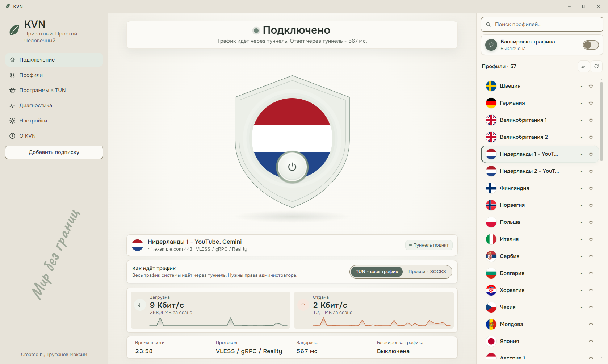
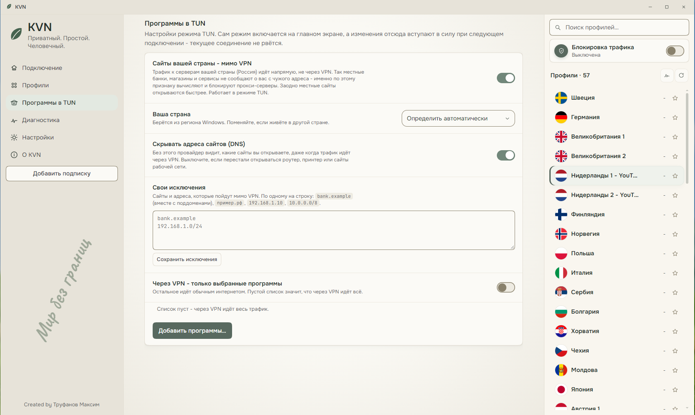

<div align="center">

# KVN

**私密。简单。有人情味。**

Windows VPN 客户端

[Русский](README.md) · [English](README.en.md) · **中文**

### [⬇ 下载 Windows 版](https://github.com/DjFatMaxx/KVN-VPN-Client/releases/latest)

</div>



KVN 连接你的 VPN 服务商提供的服务器：粘贴订阅，点击「连接」，就完成了。免费，无广告，无需注册。

> 截图为俄语界面。KVN 也支持中文和英文，可在首屏或「设置」中切换。

## 简要

> [!TIP]
> **为什么好用**
> - 一个按钮代替一堆设置：订阅、「连接」，就这些。
> - 开着 VPN，银行、政务和购物网站照常可用：本国网站不走 VPN。
> - 网络运营商看不到你通过 VPN 打开了哪些网站。
> - 可以只让 Telegram 走 VPN，点两下即可。
> - 「哪里出了问题？」按钮用大白话告诉你哪里坏了、该找谁。
>
> [详细](#useful)

> [!NOTE]
> **隐私**
> - 无账号、无广告、无遥测：不向开发者发送任何数据。
> - 订阅和密钥只保存在你的电脑上，并且加密。
> - 电脑上的其他程序无法偷偷借用你的 VPN 并得知服务器地址。
>
> [详细](#privacy)

> [!WARNING]
> **坦白说明局限**
> - 程序没有数字签名：首次运行时 Windows 会发出警告。
> - 「代理」模式下浏览器和 Telegram 通话无法使用，请用 TUN 模式。
> - 电脑睡眠或切换网络后，KVN 不会自动重连。
>
> [详细](#limits)

---

## 使用条件

- Windows 10（22H2）或 Windows 11，64 位。
- 管理员权限：KVN 需要创建网络适配器。
- VPN 服务商提供的订阅或链接。几乎所有给 Happ、v2rayN、Hiddify 用的都可以：VLESS（含 Reality）、VMess、Trojan、Shadowsocks、Hysteria2、SOCKS5。Amnezia 密钥（`vpn://...`）、WireGuard 和 OpenVPN 不适用，它们是其他协议。

## 安装

1. 在[发布页面](https://github.com/DjFatMaxx/KVN-VPN-Client/releases/latest)下载 `KVN-Setup-1.0.0.exe`。
2. 运行它。Windows 会显示蓝色的「Windows 已保护你的电脑」窗口，点击 **「更多信息」**，再点 **「仍要运行」**。[为什么会这样](#smartscreen)。
3. 选择安装文件夹（默认是 `Program Files`，保持默认即可），点击 **「安装」**。
4. 点击 **「完成」**，KVN 会出现在桌面和「开始」菜单中。

无需再下载任何东西：如果 Windows 缺少 Microsoft WebView2 组件（KVN 窗口依赖它），安装程序会自动安装。安装程序的语言取自 Windows，KVN 也会以同一语言打开。

## 首次运行

1. **「添加订阅」**：粘贴服务商给的链接（`https://...` 或 `vless://...`，可一次粘贴多条）。
2. **「选最快的」**：KVN 检测服务器并标出最快的一个。也可以自己选。
3. 点击中间的大按钮 **「连接」**。

关闭窗口不会断开 VPN：KVN 会缩到任务栏右下角的托盘。要退出，右键点击图标，选「退出 KVN」。

<a id="useful"></a>
## 功能



**银行和政务服务照常可用。** 本国网站直接打开、不走 VPN，本地服务看到的是你平常的地址，不会拦截登录。国家取自 Windows 区域设置，并在首屏显示；可在「TUN 中的程序」中更改。

**运营商看不到你访问的网站。** Windows 习惯在 VPN 之外也查询网站地址，运营商因此即使在你开着 VPN 时也能知道你去了哪里。「隐藏网站地址（DNS）」会堵住这一点，默认开启。本国网站直接连接，运营商能看到它们，不过这些本来就是直连。

**自定义例外。** 不需要走 VPN 的网站，可以直接从浏览器地址栏复制粘贴进来，它的子域名也一起生效。

**只让需要的程序走 VPN。** 比如只选浏览器和 Discord，就只有它们走 VPN，其余直接连接。

**两种模式。**
- **TUN - 全部流量**（默认）：整台电脑都走 VPN，几乎总是需要这个。
- **代理 - SOCKS**：只有你自己设置过的程序走 VPN。只想让 Telegram 走 VPN 时很方便：**「添加到 Telegram」** 会打开 Telegram Desktop，地址、用户名和密码都已填好。密码是固定的，重启后无需重新输入。

**流量拦截。** 开启后，不经过 VPN 的网络将完全关闭：连接一断，任何流量都不会直接流出，直到你重新连上。默认关闭。

**省时间的小细节。**
- 延迟通过服务器本身测量，就是连接后你实际得到的数字，而不是到最近路由器的「1 毫秒」。
- 如果服务商提供，剩余流量和订阅到期日会显示在列表中。到期前三天 KVN 会提醒。
- 随 Windows 启动：直接进入托盘，可选自动连接。
- 全局快捷键：`Ctrl+Alt+Shift+V` 连接或断开，`Ctrl+Alt+Shift+K` 显示窗口。
- 所有服务器和设置可备份成一个带密码的文件，方便换新电脑。
- Русский、English、中文。

## 出了问题怎么办

**先点「诊断」里的「哪里出了问题？」。** KVN 会逐步检查，并用大白话说明问题所在：订阅到期、服务器没有响应、从你的网络连不上服务器、杀毒软件删除了文件。

**网络断了，KVN 又打不开**（只在开启流量拦截时可能出现）。重启电脑即可，流量拦截不会在重启后保留。或者运行 KVN 文件夹里的 `UNBLOCK-KVN.bat`。

**反馈问题。** 在「诊断」中点击「复制报告」：服务器地址、密钥和网站名称都已替换为占位符。把它粘贴到你的消息里。

请发邮件至 [trufanovma@yandex.ru](mailto:trufanovma@yandex.ru)。

## 更新与卸载

**更新。** KVN 每天检查一次是否有新版本并通知你，但不会自己下载。更新方法：下载新的安装程序并运行，它会自动关闭 KVN（期间 VPN 会断开），并把新版本装到同一文件夹。服务器和设置会保留。

**卸载。** Windows「设置」-「应用」- KVN -「卸载」。KVN 创建的所有内容都会被清除，包括开机启动和 Windows 规则。

<a id="privacy"></a>
## 隐私

- **无账号、无广告、无遥测。** KVN 不向开发者发送任何数据。
- **一切都在你这里。** 订阅、密钥和设置只保存在这台电脑上，由 Windows 加密。
- **KVN 自己会访问的地方，完整列表：**
  - 你的订阅：更新时访问（定时更新只经过 VPN）；
  - Cloudflare、Google 或 Quad9（DNS-over-HTTPS）：查询服务器的地址和国家；
  - `gstatic.com`：检测延迟时，通过被检测的服务器访问；
  - GitHub：每天一次，获取最新版本号（可在设置中关闭）。
- **代理有密码保护。** 大多数 VPN 客户端在电脑上留着一个开放入口，任何程序都能绕过你的设置并得知服务器地址。KVN 用用户名和密码关上了它，而且每次安装的端口都不同。
- **报告已匿名。** 求助用的报告不会自动发送，只有你自己复制才会离开电脑。其中的服务器地址、密钥和网站名称都已替换为占位符。
- **不安全的订阅会被标出。** KVN 接受 `http://` 订阅，但会明确提醒：带有你令牌的链接在传输路径上对所有人可见。

<a id="limits"></a>
## 坦白说明局限

- **程序没有签名。** 开发者证书需要付费，并且只发给公司，所以首次运行时 Windows 会警告。[如何校验文件](#smartscreen)。
- **「代理」模式不适合浏览器和通话。** Chrome、Edge 和 Firefox 不支持带密码的代理，Telegram 通话也无法通过这种代理。请用 TUN 模式。
- **这台电脑上的程序能看出 VPN 已开启**：通过网络适配器和内核进程。没有任何客户端能隐藏这一点。
- **「只让选定的程序走 VPN」并非绝对。** 程序按文件名识别：两个都叫 `chrome.exe` 的浏览器会一起走。Windows 有时来不及把极短的连接对应到程序，这些连接会直接走。
- **睡眠和切换网络。** 睡眠后或从 Wi-Fi 切换到移动网络后，KVN 不会自动重连：断开再连接即可。欢迎告诉我们你的情况，这很有帮助。
- **分片**（用于与服务器连接不稳定时的设置）并非在所有网络中都有效。
- **Windows 留下的痕迹。** 卸载后，Windows 自己记录的内容会保留：网络适配器驱动、网络记录、网络使用历史。任何程序都清除不了。

<a id="smartscreen"></a>
## 为什么 Windows 会警告

对于没有签名的程序，Windows 首次运行时会弹出蓝色的 SmartScreen 窗口。点击「更多信息」-「仍要运行」。

确认文件确实来自这里：打开文件所在的下载文件夹，点击资源管理器顶部的地址栏，输入 `cmd` 并回车。在打开的窗口中执行

```
certutil -hashfile KVN-Setup-1.0.0.exe SHA256
```

得到的那串字母和数字必须与发布说明中的 SHA256 一致。不一致就不要运行。

杀毒软件也可能起疑：KVN 会创建网络适配器并启动 Xray 内核。只有校验值一致时，才把 KVN 加入排除项。

## 支持作者

在 KVN 窗口中，点击侧边栏底部的作者姓名。

## 使用的开源项目

[Xray-core](https://github.com/XTLS/Xray-core)（MPL-2.0）连接内核，[Wintun](https://www.wintun.net) 网络适配器，[Wails](https://wails.io)（MIT）窗口，[flag-icons](https://github.com/lipis/flag-icons)（MIT）国旗，字体 Onest、JetBrains Mono、Caveat、Ma Shan Zheng（SIL OFL 1.1）。

KVN 免费分发，源代码不公开。
